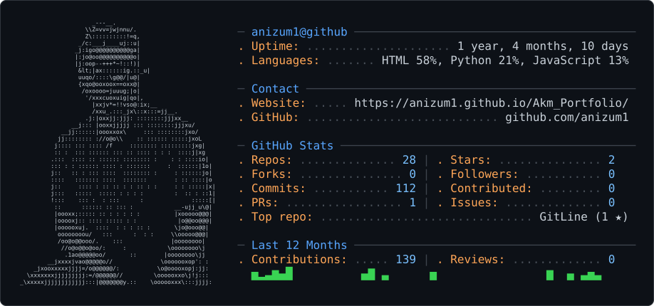

<picture>
  <source media="(prefers-color-scheme: dark)" srcset="dark_mode.svg" />
  <source media="(prefers-color-scheme: light)" srcset="light_mode.svg" />
  
</picture>

# Hi, I'm Akm Nizum

**Cybersecurity specialist · Incident response · Security tooling in Python** 
Dallas, TX · Open to remote and on-site roles

I work on the defensive side of security: responding to incidents, hunting threats, hardening
systems, and writing the Python tools that make that work faster. I'm finishing a Bachelor of
Applied Technology in Cybersecurity at Collin College, an NSA CAE-CD validated program, and I
hold the CCNA.

I'm looking for roles in **threat hunting, incident response, and security architecture**.

## Experience

- **Incident Response Specialist** at Technauf IT Service (freelance, 2024–present).
  Security assessments, threat hunting, incident handling, forensic analysis, and SIEM rollouts
  for small and mid-sized businesses.
- **Production Lead** at Shutterfly LLC (Plano, TX, 2020–present).
  Leads production operations, equipment troubleshooting, and staff training.

## Featured projects

| Project | What it does | Stack |
| --- | --- | --- |
| [**GitLine**](https://github.com/anizum1/GitLine) | Scans GitHub repos for hard-coded credentials across code, git history, and binaries. Uses about 50 credential patterns plus an entropy check, and redacts findings as soon as it finds them. | JavaScript |
| [**RI-Thoric**](https://github.com/anizum1/RI-Thoric) | Web application security scanner that follows a 5-phase methodology and writes HTML and JSON reports. | Python |
| [**API Scanner**](https://github.com/anizum1/API_Scanner) | Finds API endpoints, runs basic security checks, and exports JSON, TXT, or PDF reports. | Python |
| [**Sihmasi**](https://github.com/anizum1/Sihmasi) | Metadata forensics: pulls EXIF and GPS data out of images and video with ExifTool. | Python |
| [**Technauf IT Solutions**](https://github.com/anizum1/TechnaufITV2.0) | Business website for a managed IT and cloud services company. | HTML · CSS · JS |

More projects, 17 CCNA labs, and my research presentations are on
[my portfolio](https://anizum1.github.io/Akm_Portfolio/).

## Toolkit

- **Security:** Splunk · Snort · Security Onion · Wazuh · Wireshark · Nmap · Burp Suite · Metasploit · Autopsy
- **Networking:** Cisco IOS · VLANs and trunking · OSPF and EIGRP · ACLs · IPv4/IPv6 · DHCP, DNS, NTP
- **Cloud and systems:** AWS · Azure · Docker · Linux (Kali, Ubuntu) · Windows · Active Directory
- **Languages:** Python · Bash · JavaScript · HTML/CSS

## Education and certifications

- B.A.T. in Cybersecurity, Collin College (NSA CAE-CD validated program)
- CCNA: Cisco Certified Network Associate
- Information Systems Cybersecurity Certificate
- Cybersecurity Infrastructure Technician Certificate

---

All security tools here are for authorized testing, research, and education only.
